<h1 align="center">Hey  I'm Tomas Dvorak</h1>
<h3 align="center">AI-Powered Product Builder & Systems Architect</h3>

  

## 📊 GitHub Stats & Trophies

  
  

  

## 🔗 Connect with Me

   

<picture>
  <source media="(prefers-color-scheme: dark)" srcset="https://raw.githubusercontent.com/cyprieng/github-breakout/main/example/dark.svg" />
  <source media="(prefers-color-scheme: light)" srcset="https://raw.githubusercontent.com/cyprieng/github-breakout/main/example/light.svg" />
  
</picture>

